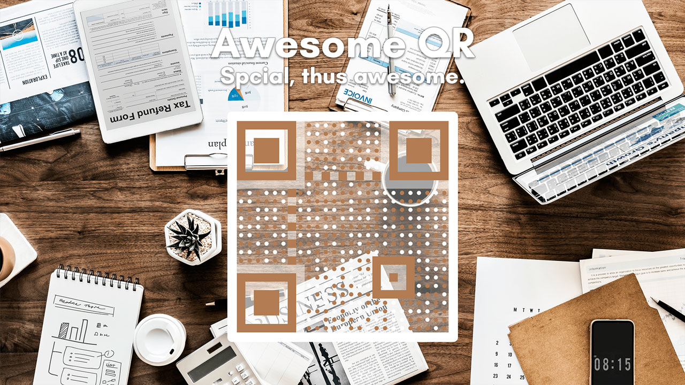

> 这篇文档中的内容已经过时，请暂以英文文档的内容为准，谢谢。




[](https://jitpack.io/#SumiMakito/AwesomeQRCode)
[](https://github.com/SumiMakito/AwesomeQRCode/releases/latest)
[](https://github.com/SumiMakito/AwesomeQRCode/blob/master/LICENSE)


AwesomeQRCode - 一个优雅的<del>（不起眼的）</del> QR 二维码生成器

> [Swithc to English Version?](README.md)

## 好耶！ 演示应用！

<a href="https://play.google.com/store/apps/details?id=com.github.sumimakito.awesomeqrsample" target="_blank"></a>

## 样例

> 拿起你的手机扫描下面的二维码试试吧！

样例 1 | 样例 2 | 样例 3
------------ | ------------- | -------------
 |  | 

使用圆点做数据点 | 二值化处理 | 带有 Logo
------------ | ------------- | -------------
 |  | 

## 引用

> <del>万事开头难, 补全就好啦!</del>

在项目根目录下的 build.gradle 中补充以下内容，以添加依赖项：

```
allprojects {
	repositories {
		...
		maven { url 'https://jitpack.io' }
	}
}
```

在应用模块层级下的 build.gradle 中补充以下内容：

```
dependencies {
        compile 'com.github.SumiMakito:AwesomeQRCode:1.0.6'
}
```

## 快速上手

### 1. "人家只想要 Bitmap 嘛"

> <del>原来乃只想要 Bitmap 撒... 满足你!!</del>

这种情况下，二维码将同步（synchronously）生成，这有可能阻塞 UI 线程，引起应用无响应（ANR）问题。因此建议在非 UI 线程中使用。

```java
new Thread() {
  @Override
  public void run() {
   super.run();
   Bitmap qrCode = new AwesomeQRCode.Renderer()
    .contents("Makito loves Kafuu Chino.")
    .size(800).margin(20)
    .render();
  }.start();
```

### 2. 异步生成二维码并在 ImageView 中显示

```java
new AwesomeQRCode.Renderer()
 .contents("Makito loves Kafuu Chino.")
 .size(800).margin(20)
 .renderAsync(new AwesomeQRCode.Callback() {
  @Override
  public void onRendered(AwesomeQRCode.Renderer renderer, final Bitmap bitmap) {
   runOnUiThread(new Runnable() {
    @Override
    public void run() {
     // 提示: 这里使用 runOnUiThread(...) 来规避从非 UI 线程操作 UI 控件时产生的问题。
     imageView.setImageBitmap(bitmap);
    }
   });
  }

  @Override
  public void onError(AwesomeQRCode.Renderer renderer, Exception e) {
   e.printStackTrace();
  }
 });
```

## 渲染流程

```
Bitmap bitmap = new AwesomeQRCode.Renderer() ...
```

### 基本

#### .contents(String)

*必需*<br>
欲编码的内容。<br>
默认为 *null*。

#### .size(int)

*必需*<br>
尺寸，长宽一致，包含外边距。<br>
单位是 *px*。
默认为 *800*。

#### .margin(int)

二维码图像的外边距。<br>
单位是 *px*。<br>
默认为 *20*。

#### .dataDotScale(float)

数据点缩小比例。<br>
默认为 *0.3f*。

#### .roundedDataDots(boolean)

若为 true，数据区域将以圆点绘制。<br>
默认为 *false*。

#### .whiteMargin(boolean)

若设为 true，背景图外将绘制白色边框。<br>
默认为 *true*。

### 后处理

#### .binarize(boolean)

若为 true，图像将被二值化处理。<br>
默认为 *false*。

#### .binarizeThreshold(int)

二值化处理的阈值。<br>
默认为 *128*。

### 颜色

#### .autoColor(boolean)

若为 true，背景图（或 GIF 的每一帧）中的主要颜色将作为非空白区域的颜色。<br>
默认为 *true*。

#### .colorDark(int)

非空白区域的颜色。<br>
默认为 *Color.BLACK*。

#### .colorLight(int)

空白区域的颜色。<br>
默认为 *Color.WHITE*。

### Background

#### .background(Bitmap)

欲嵌入的背景图，设为 null 以禁用。<br>
默认为 *null*。

#### .backgroundGif(File)

*必须是 GIF 类型图片，否则将出错。*<br>
欲嵌入的 GIF 背景图，设为 null 以禁用。<br>
默认为 *null*。

#### .backgroundGifCropRect(RectF)

裁切 GIF 所使用的矩形区域。<br>
默认为 *null*。

#### .saveTo(File)

*设置 backgroundGif 时必须指定。*<br>
生成 GIF QR 二维码的输出文件。<br>
默认为 *null*。

### Logo

#### .logo(Bitmap)

欲嵌入至二维码中心的 Logo，设为 null 以禁用。<br>
默认为 *null*。

#### .logoMargin(int)

Logo 周围的空白边框，设为 0 以禁用。<br>
单位是 *px*。<br>
默认为 *10*。

#### .logoCornerRadius(int)

Logo 及其边框的圆角半径，设为 0 以禁用。<br>
单位是 *px*。<br>
默认为 *8*。

#### .logoScale(float)

用于计算 Logo 大小的比例，过大可能会导致解码问题。<br>
默认为 *0.2f*。

```
... .render(); // 得到 Bitmap
```

### 更新日志

#### 1.1.1 版本

- 修复了上一版本中生成的 QR 二维码图块间出现空白间隙的问题

####  1.1.0 版本

- 加入 GIF 支持
- 修复既有问题

#### 1.0.6 版本

- 修复 divide by zero 错误

#### 1.0.5 版本

- 使用 AwesomeQRCode 的方式变的更优雅

#### 1.0.4 版本

- 可以在二维码中选择嵌入 Logo
- 演示应用更新

#### 1.0.3 版本

- 在二维码中的 Hints 中加入 CHARACTER_SET => UTF-8 
- 修复 [#7](https://github.com/SumiMakito/AwesomeQRCode/issues/7) 中提到的编码问题

#### 1.0.2 版本

- 加入使用圆点绘制二维码数据点的选项

#### 1.0.1 版本

- 加入背景二值化的支持

#### 1.0.0 版本

- 初次发布

## 相关项目

### Swift 下的 EFQRCode 

AwesomeQRCode 受 [由 EyreFree 创造的 EFQRCode](https://github.com/EyreFree/EFQRCode) 所启发而生，它是一个轻量级的、用来生成和识别二维码的纯 Swift 库，可根据输入的水印图和图标产生艺术二维码，基于 CoreImage 进行开发。受 qrcode 启发。EFQRCode 为你提供了一种更好的在你的 App 中操作二维码的方式。

### 可在网页使用的 JavaScript 版: Awesome-qr.js

详情请至 [Awesome-qr.js](https://github.com/SumiMakito/Awesome-qr.js)

### <del>强大的 Kotlin （复刻）版: AwesomeQRCode-Kotlin</del> 

更新较慢，不推荐使用。

详情请至 [AwesomeQRCode-Kotlin](https://github.com/SumiMakito/AwesomeQRCode-Kotlin)

## 捐赠

可以请我喝一杯卡布奇诺吗？

PayPal | 支付宝
----|----
[PayPal](https://www.paypal.me/makito) | [支付宝](https://qr.alipay.com/a6x02021re1jk4ftcymlw79)

## 版权信息与授权许可


AwesomeQRCode is available under the Apache-2.0 license. See the LICENSE file for more info.   
Copyright &copy; 2017-2018 Makito.

## 排他性发行协议

包含、引用、修改、再分发或使用本项目，即代表您已阅读并同意本排他性发行协议中的条款。

**当再发行此开源软件时，此协议需与 APACHE 2.0 许可一同提供。**

您**可以**：

- 在项目中使用 AwesomeQRCode（商业与非商业项目皆可）。
- 按需要修改 AwesomeQRCode 的代码。
- 按照本排他性发行协议以及 APACHE 2.0 许可再发行修改后的代码。

您**不可以**：

- 使用 AwesomeQRCode 作为您应用的**主要**或**唯一**功能。
- 将 AwesomeQRCode 的**部分**或**全部**内容作为可销售商品。
- 制作 AwesomeQRCode 的演示应用，并提交至商店（包括但不限于 Google Play Store）。

