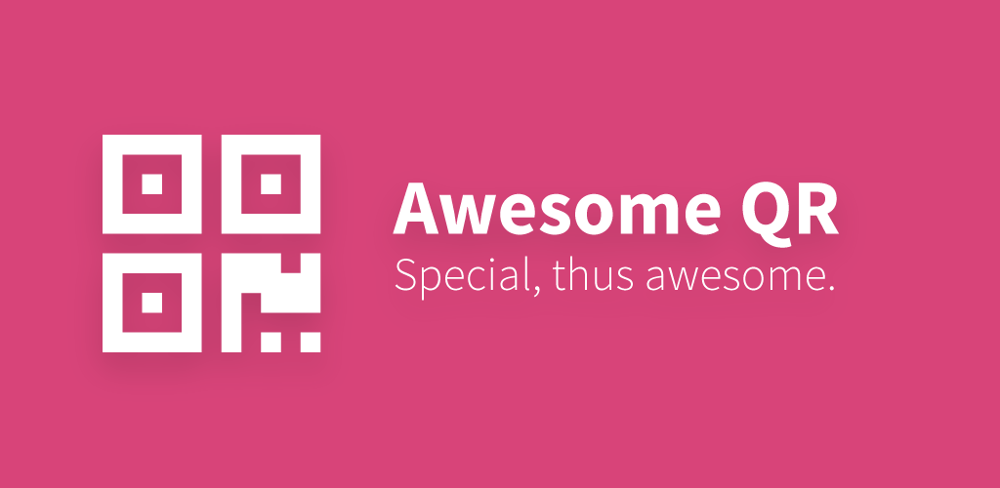
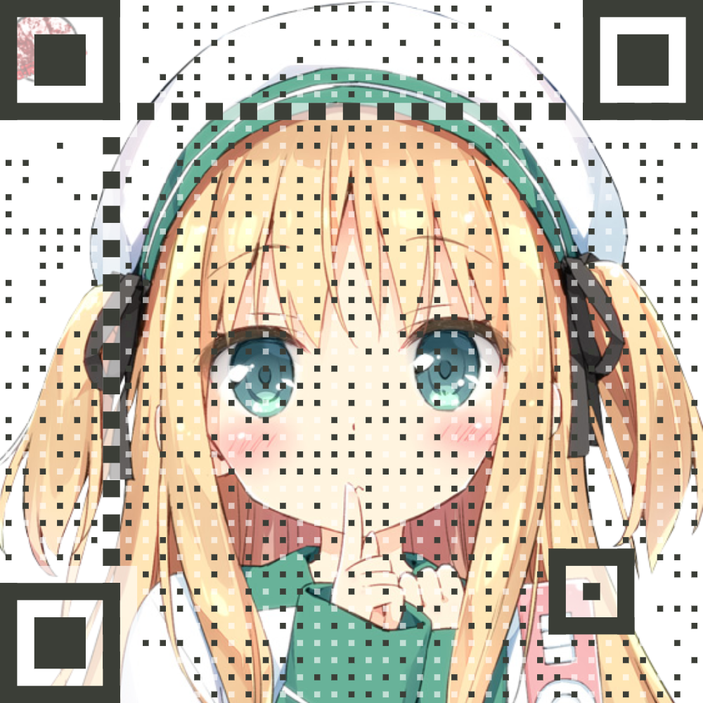
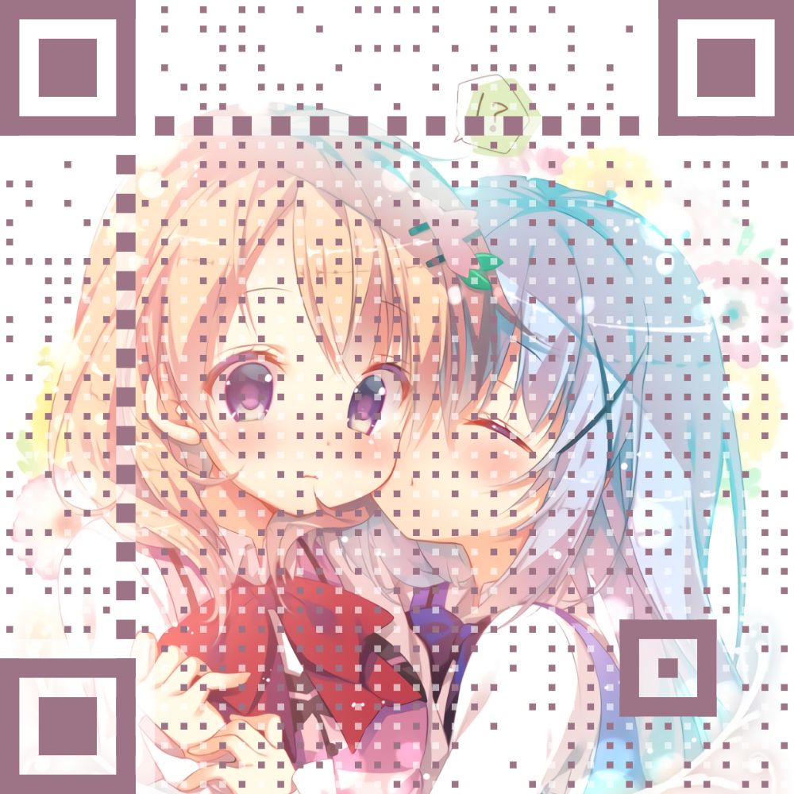
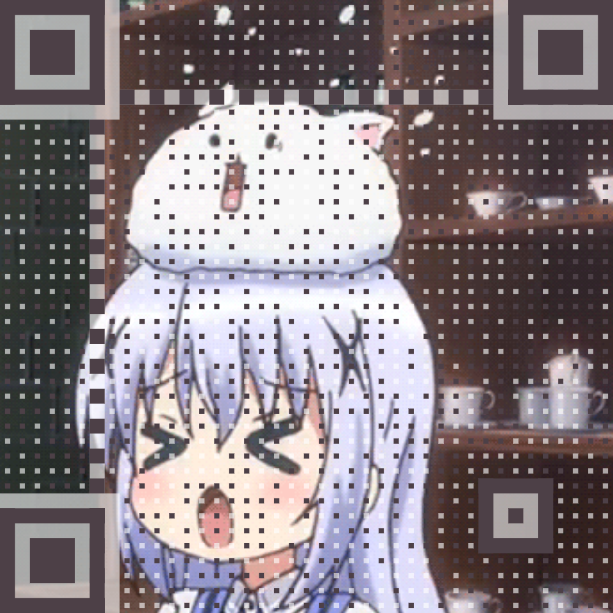
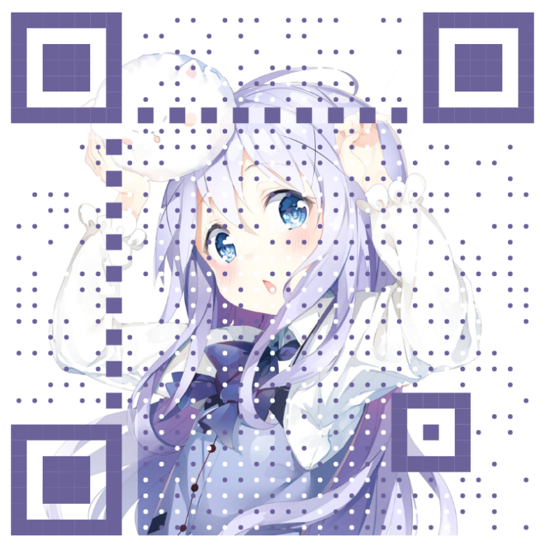
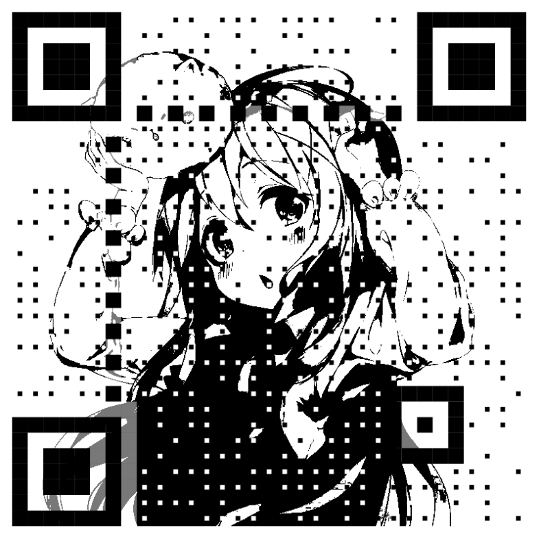
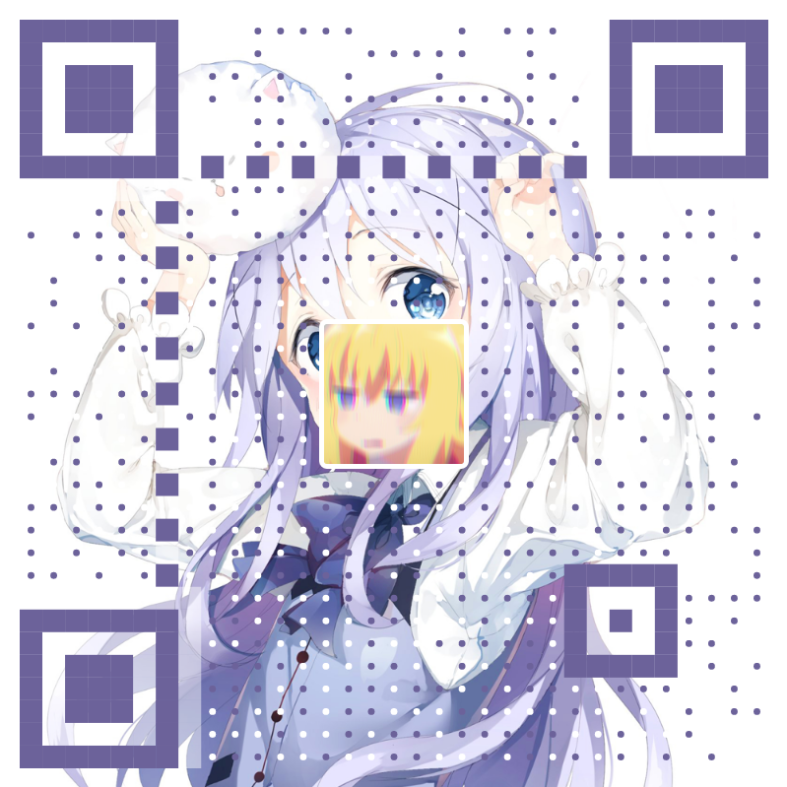

# AwesomeQRCode
[](https://jitpack.io/#SumiMakito/AwesomeQRCode)
[](https://github.com/SumiMakito/AwesomeQRCode/blob/master/LICENSE)
[](https://github.com/SumiMakito/AwesomeQRCode/releases/latest)

An awesome<del>(simple)</del> QR code generator for Android.

一个优雅的<del>(不起眼的)</del> QR 二维码生成器



### Get sample APK, 下载演示 APK

<a href="https://play.google.com/store/apps/details?id=com.github.sumimakito.awesomeqrsample" target="_blank"></a>

### Examples, 样例

> Try to scan these QR codes below with your smart phone.

Example 1|Example 2|Example 3
------------ | ------------- | -------------
 |  | 


Solid dots instead of blocks|Binarized|With logo at the center
------------ | ------------- | -------------
 |  | 

### Add dependency into your project, 添加依赖项

Add below lines in build.gradle of your project:
```
allprojects {
	repositories {
		...
		maven { url 'https://jitpack.io' }
	}
}
```

Then, add below lines in build.gradle of your app module:
```
dependencies {
        compile 'com.github.SumiMakito:AwesomeQRCode:1.0.4'
}
```

### Quick start, 快速上手

```java
Bitmap qrCode = AwesomeQRCode.create("Makito loves Kafuu Chino.", 800, 20);
Bitmap qrCodeWithBackground = AwesomeQRCode.create("Makito loves Kafuu Chino.", 800, 20, backgroundBitmap);
Bitmap qrCodeWithLogo = AwesomeQRCode.create("Makito loves Kafuu Chino.", 800, 20, null, logoBitmap);
Bitmap qrCodeWithBackgroundAndLogo = AwesomeQRCode.create("Makito loves Kafuu Chino.", 800, 20, backgroundBitmap, logoBitmap);
```

### Parameters, 参数

> Here's a full list of all parameters, but some of them are optional. You can view all the possible simplified methods at the end of AwesomeQRCode.java.

> (Translation) 以下列出全部参数，但其中部分参数是可选的。关于简化的调用方法，请查看 AwesomeQRCode.java 的结尾部分。

```java
public static Bitmap create(
        String contents,
        int size,
        int margin,
        float dataDotScale,
        int colorDark,
        int colorLight,
        Bitmap backgroundImage,
        boolean whiteMargin,
        boolean autoColor,
        boolean binarize,
        int binarizeThreshold,
        boolean roundedDataDots,
        Bitmap logoImage,
        int logoMargin,
        int logoCornerRadius,
        float logoScale
) throws IllegalArgumentException { ... }
```

Parameter | Explanation
----|----
contents (String) | Contents to encode. 欲编码的内容
size (int-px) | Width as well as the height of the output QR code, includes margin. 尺寸, 长宽一致, 包含外边距
margin (int-px) | Margin to add around the QR code. 二维码图像的外边距, 默认 20px
dataDotScale (float) | Value used to scale down the data dots' size. (0 < scale < 1.0f) 数据区域点缩小比例
colorDark (int-color) | Color of "true" blocks. Works only when both colorDark and colorLight are set. (BYTE_DTA, BYTE_POS, BYTE_AGN, BYTE_TMG) 实点的颜色
colorLight (int-color) | Color of empty space, or "false" blocks. Works only when both colorDark and colorLight are set. (BYTE_EPT) 空白区的颜色
backgroundImage (Bitmap) | Background image to embed in the QR code. Leave null to disable. 欲嵌入的背景图, 设为 null 以禁用
whiteMargin (int-px) | If set to true, a white border will appear around the background image. Default is true. 若设为 true, 背景图外将绘制白色边框
autoColor (boolean) | If set to true, the dominant color of backgroundImage will be used as colorDark. Default is true. 若为 true, 背景图的主要颜色将作为实点的颜色, 即 colorDark
binarize (boolean) | If set to true, the whole image will be binarized with the given threshold, or default threshold if not specified. Default is false. 若为 true, 图像将被二值化处理, 未指定阈值则使用默认值
binarizeThreshold (int) | Threshold used to binarize the whole image. Default is 128. (0 < threshold < 255) 二值化处理的阈值
roundedDataDots (boolean) | If set to true, data dots will appear as solid dots instead of blocks. Default is false. 若为 true, 数据点将以圆点绘制, 取代默认的小方块
logoImage (Bitmap) | Logo image to embed at the center of generated QR code. Leave null to disable. 欲嵌入至二维码中心的 LOGO 标识, 设为 null 以禁用
logoMargin (int-px) | White margin that appears around the logo image. Leave 0 to disable. LOGO 标识周围的空白边框, 设为 0 以禁用
logoCornerRadius (int-px) | Radius of the logo's corners. Leave 0 to disable. LOGO 标识及其边框的圆角半径, 设为 0 以禁用
logoScale (float) | Value used to scale the logo image. Larger value may result in decode failure. Size of the logo equals to `logoScale*(size-2*margin)`. Default is 0.2f. 用于计算 LOGO 大小的值, 过大将导致解码失败, LOGO 尺寸计算公式 `logoScale*(size-2*margin)`, 默认 0.2f


### Changelog, 更新日志

#### 1.0.4
New feature: Embedding a logo image in the QR code.
Sample/Demo application updated.

#### 1.0.3
Added CHARACTER_SET => UTF-8 to QR code's hints before encoding.
Fixed an encoding issue mentioned in [#7](https://github.com/SumiMakito/AwesomeQRCode/issues/7).

#### 1.0.2
Added an optional parameter which enables the data dots to appear as filled circles.

#### 1.0.1
Now background images can be binarized as you like.

#### 1.0.0
Initial release.

### Alternatives on other platforms/in other languages. 其他平台或语言下的对等项目

#### EFQRCode written in Swift

EFQRCode is a tool to generate QRCode image or recognize QRCode from image, in Swift.

AwesomeQRCode is inspired by [EFQRCode by EyreFree](https://github.com/EyreFree/EFQRCode).

If your application is in need of generating pretty QR codes in Swift, take a look at EFQRCode. It should help.

#### Awesome-qr.js written in JavaScript, 支持 JavaScript 的 Awesome-qr.js

Redirect to [Awesome-qr.js](https://github.com/SumiMakito/Awesome-qr.js)

### Would you like to buy me a cup of cappuccino? 要请我喝一杯卡布奇诺吗？
PayPal | Alipay
----|----
[PayPal](https://www.paypal.me/makito) | [Alipay](https://qr.alipay.com/a6x02021re1jk4ftcymlw79)

### Copyright &amp; License, 版权信息与授权协议

Copyright &copy; 2017 Sumi Makito

Licensed under Apache License 2.0 License.

```
Copyright 2017 Sumi Makito

Licensed under the Apache License, Version 2.0 (the "License");
you may not use this file except in compliance with the License.
You may obtain a copy of the License at

    http://www.apache.org/licenses/LICENSE-2.0

Unless required by applicable law or agreed to in writing, software
distributed under the License is distributed on an "AS IS" BASIS,
WITHOUT WARRANTIES OR CONDITIONS OF ANY KIND, either express or implied.
See the License for the specific language governing permissions and
limitations under the License.
```
